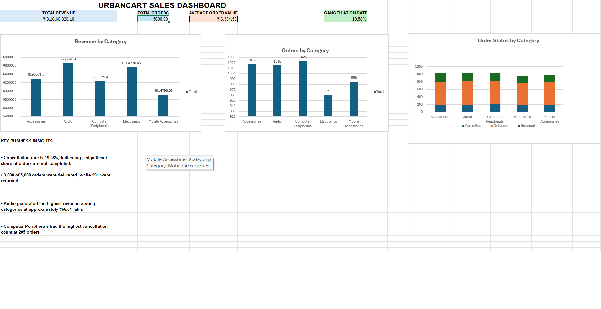

# UrbanCart Sales Analytics Dashboard

## Project Overview

UrbanCart is a fictional online retail business analytics project built using Microsoft Excel.

The objective of this project is to transform raw sales data into an interactive business dashboard that helps understand revenue, order performance, cancellations, returns, and category-level performance.

## Tools Used

- Microsoft Excel
- PivotTables
- PivotCharts
- Excel Formulas
- Data Analysis
- Business Insights

## Key KPIs

- Total Revenue: ₹3.17 Crore
- Total Orders: 5,000
- Average Order Value: ₹6,334.53
- Cancellation Rate: 19.58%
- Delivered Orders: 3,030
- Returned Orders: 991

## Dashboard Preview

## Dashboard Analysis

The dashboard includes:

- Revenue by Category
- Orders by Category
- Order Status by Category
- Key Business Insights
- KPI Summary

## Business Insights

- Cancellation rate is 19.58%, indicating a significant share of orders are not completed.
- 3,030 of 5,000 orders were delivered, while 991 were returned.
- Audio generated the highest revenue among categories at approximately ₹66.61 lakh.
- Computer Peripherals had the highest cancellation count at 205 orders.

## Project Structure

`UrbanCart_Sales_Dashboard.xlsx` — Complete Excel dashboard and analysis.

## Note

UrbanCart is a fictional dataset created for portfolio and learning purposes.
